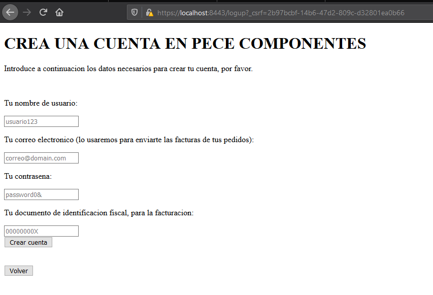
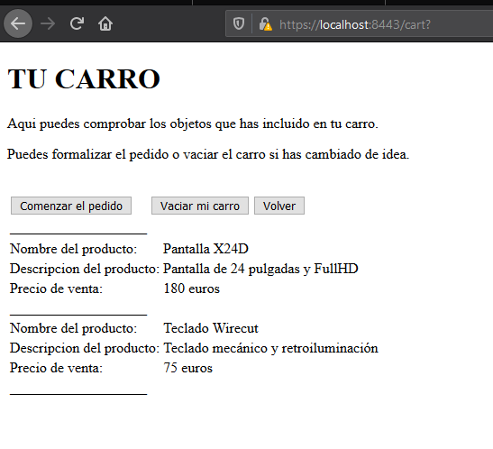
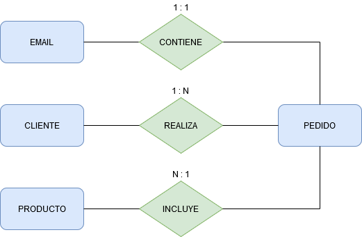

# practica-dad: PECE COMPONENTES
Repositorio para la práctica de Desarrollo de aplicaciones distribuidas de GDDV+GIC de la URJC

# fase 1

## aplicación web
Nombre: PECE componentes

Descripción: PECE componentes se trata de una página de venta de productos de electrónica, en la que se ofrecen pantallas, teclados, ratones, antenas, etc; al mejor precio. PECE componentes solo ofrece sus grandes ofertas a los clientes registrados, así que los invitados pueden navegar por la tienda pero solo los usuarios pueden añadir productos a sus pedidos y comprarlos.

## entidades

· Cliente: cada uno de los usuarios que usan la página. Pueden ser usuarios registrados. Puede hacer pedidos de uno o varios productos.

· Pedido: incluye una serie de productos que un cliente quiere comprar. A la hora de realizar la compra, la página se encargará de enviar un mensaje al correo del usuario con una factura del pedido que acaba de realizar.

· Producto: cada uno de los productos presentes en la tienda, cuenta con un nombre, una descripción y un precio.

## servicio interno
El servicio interno se encargará de recoger los pedidos que hacen los clientes y procesar los datos para enviárselos al usuario correspondiente por correo.

## equipo
Sergio Rus González (s.rus@alumnos.urjc.es) (github: giruza)

# fase 2

En esta fase se debe definir e implementar la aplicación web con base de datos MySQL. Las pantallas que tendrá la aplicación serán inicialmente públicas, aunque hay que decidir cuáles son públicas y cuáles privadas para la fase 3. Sus HTML hay que generarlos mediante Mustache.

## navegación por la página

La página de inicio de la aplicación es /greeting, y desde aquí se puede acceder a la mayoría de pantallas de la aplicación. A continuación se muestra un diagrama del flujo de navegación por la página.

En la página principal encontramos, cuando accedemos sin logear, dos opciones: iniciar sesión, o registrarnos. Si ya tenemos una cuenta podemos iniciar sesión, si no, será necesario que nos registremos. Si intentamos acceder a una página que requiere login sin estar logueados se nos redirigirá a la página de login.

En la página de login, se nos pide introducir nuestro nombre de usuario y contraseña, si es correcto se nos envía de vuelta a greeting mostrando nuevas opciones, si no, seguimos en el login.

En cuanto al registro, se nos pide introducir los datos necesarios para crear un nuevo cliente: el nombre de usuario, la contraseña, el correo en el que recibiremos los mensajes y el DNI a modo de identificador. Una vez creada la cuenta nos redirige al inicio.

Una vez logueados, podemos ir a logout si queremos cerrar sesión, en cuyo caso se nos notifica que se va a cerrar la sesión y luego se vuelve al inicio. Por otra parte, ya podemos acceder a la tienda, donde vemos la lista de productos disponibles para comprar.

Cuando añadimos los productos en los que estamos interesados, podemos ir a nuestro carro para ver la lista de productos que hemos seleccionado.

Si estamos seguros de que tenemos los productos que queremos comprar, podemos iniciar el pedido. A continuación se nos pide introducir los datos necesarios para crear un pedido nuevo: el nombre del pedido, la dirección a la que se enviará, el método de pago y el municipio en el que se entrega.

Una vez tenemos los datos del pedido, podemos confirmarlo, se nos informa de que se enviará un correo a nuestra dirección, y se nos redirige a inicio.

## modelo de datos

En los siguientes diagramas se muestra cómo quedaría el modelo de datos de la aplicación, expresado tanto en un diagrama entidad relación como en un diagrama de clases UML.

